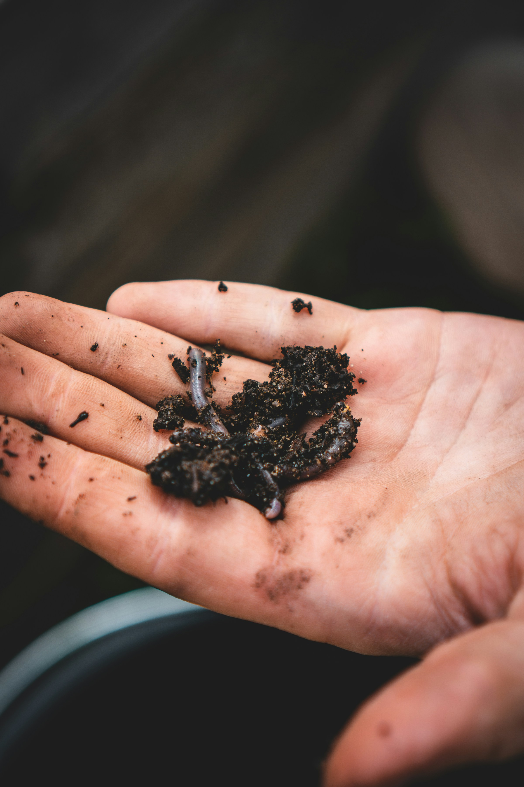
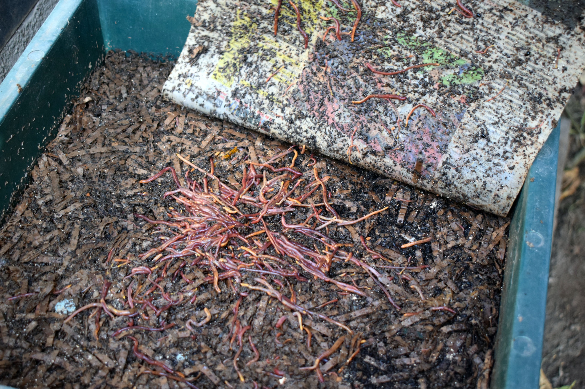

La cantidad de lombrices que necesitas para empezar depende de una variable principal: cuántos residuos orgánicos quieres procesar.

No necesitas partir con miles de lombrices. Una colonia pequeña puede crecer con el tiempo si tiene alimento, humedad, oxígeno y temperatura adecuados. Pero si empiezas con muy pocas, el proceso será lento y tendrás que alimentar con cuidado para no saturar la vermicompostera.

Como regla práctica, para una vermicompostera doméstica conviene comenzar con una cantidad moderada de lombrices y aumentar la alimentación gradualmente. El error más común no es comprar pocas lombrices. Es darles demasiada comida durante las primeras semanas.

## 1. La respuesta corta

Para una vermicompostera doméstica, estas cantidades funcionan bien como punto de partida:

| Tipo de hogar                      | Cantidad inicial recomendada              |
| ---------------------------------- | ----------------------------------------- |
| 1 persona                          | 250 a 500 g de lombrices                  |
| 2 personas                         | 500 g de lombrices                        |
| 3 a 4 personas                     | 500 g a 1 kg de lombrices                 |
| 5 o más personas                   | 1 kg o más de lombrices                   |
| Colegio, comunidad o huerto grande | Desde 1 kg, idealmente con sistema amplio |

Estas cifras son orientativas. La cantidad adecuada depende más de los hábitos de cocina que del número de personas.

Una persona que cocina todos los días puede generar más residuos útiles que una familia que come fuera de casa la mayor parte de la semana.

## 2. Peso de lombrices vs número de lombrices

Las lombrices normalmente se compran por peso, no por unidad.

Esto es más práctico porque una colonia incluye lombrices adultas, juveniles, capullos y algo de sustrato donde vienen viviendo.

Como referencia aproximada:

| Peso aproximado | Uso recomendado                       |
| --------------- | ------------------------------------- |
| 250 g           | Inicio pequeño o sistema de prueba    |
| 500 g           | Vermicompostera doméstica estándar    |
| 1 kg            | Hogar con alta generación de residuos |
| Más de 1 kg     | Sistemas grandes o comunitarios       |

No conviene obsesionarse con el número exacto de individuos. Lo importante es que la colonia tenga buenas condiciones para adaptarse, alimentarse y reproducirse.

## 3. Cuánta comida pueden procesar

Muchas guías dicen que las lombrices pueden comer una cantidad cercana a su propio peso en alimento por día.

En la práctica doméstica, esa cifra suele ser demasiado optimista para empezar.

Durante las primeras semanas, usa una regla más conservadora:

| Cantidad de lombrices | Alimentación inicial sugerida          |
| --------------------- | -------------------------------------- |
| 250 g                 | 1 a 2 puñados pequeños cada pocos días |
| 500 g                 | 2 a 3 puñados pequeños cada pocos días |
| 1 kg                  | 4 a 6 puñados pequeños cada pocos días |

Observa la velocidad real de procesamiento antes de aumentar la cantidad.

Si la comida anterior sigue reconocible, espera. Si desaparece rápido y no hay olor, puedes aumentar gradualmente.

## 4. Por qué no conviene alimentar al máximo desde el primer día

Una vermicompostera recién instalada todavía no tiene una comunidad microbiana estable.

Las lombrices no comen residuos frescos como si fueran mascotas comiendo pellets. Lo que aprovechan principalmente es materia orgánica ya colonizada por microorganismos.

Por eso, al inicio conviene alimentar poco.

Si agregas demasiada comida desde el primer día, pueden aparecer:

- Malos olores
- Exceso de humedad
- Mosquitas
- Aumento de temperatura
- Fuga de lombrices

La colonia necesita tiempo para adaptarse al nuevo ambiente.

## 5. Qué pasa si empiezas con pocas lombrices

Empezar con pocas lombrices no es un problema grave.

El sistema funcionará, pero será más lento.

Tendrás que:

- Alimentar en cantidades pequeñas
- Esperar más entre alimentaciones
- Tener más paciencia para la primera cosecha
- Evitar comparar tu sistema con uno ya maduro.

La ventaja de empezar con pocas lombrices es que aprendes a observar el proceso y reduces el riesgo de desperdiciar alimento dentro de la vermicompostera.

La desventaja es que tardarás más en procesar una cantidad significativa de residuos.

## 6. Qué pasa si empiezas con demasiadas lombrices

Tener muchas lombrices no siempre significa procesar más residuos.

Si el contenedor es pequeño o el sustrato inicial es pobre, una población excesiva puede generar competencia por espacio, alimento y humedad.

Esto puede provocar:

- Estrés
- Menor reproducción
- Migración
- Acumulación de lombrices en zonas húmedas
- Necesidad de manejo más frecuente

Una colonia grande necesita un sistema proporcionalmente grande y estable.

No compres más lombrices de las que tu vermicompostera puede sostener.

## 7. Cómo calcular según tus residuos

La forma más confiable es observar cuántos residuos vegetales generas en una semana.

Durante tres o cuatro días separa tus residuos aptos para vermicompostaje:

- Cáscaras de frutas
- Restos de verduras
- Borra de café
- Té
- Hojas externas de hortalizas

No incluyas carnes, lácteos, aceites ni comida muy condimentada.

Luego estima el volumen semanal.

| Residuos vegetales generados | Inicio recomendado             |
| ---------------------------- | ------------------------------ |
| Muy pocos residuos           | 250 g de lombrices             |
| 1 a 2 litros por semana      | 500 g de lombrices             |
| 3 a 5 litros por semana      | 500 g a 1 kg                   |
| Más de 5 litros por semana   | 1 kg o más, con sistema amplio |

Si produces más residuos de los que tu colonia puede procesar, guarda parte en el congelador o deriva una fracción al compostaje tradicional.

## 8. Cuándo aumentar la cantidad de lombrices

No siempre necesitas comprar más lombrices.

Una colonia sana se reproduce sola.

Puedes considerar aumentar la población si:

- El alimento desaparece rápido
- No hay malos olores
- La humedad está estable
- El contenedor tiene espacio disponible
- Quieres procesar más residuos de forma sostenida

También puedes dividir una colonia madura para iniciar una segunda vermicompostera.

Esto suele ser mejor que intentar forzar un sistema pequeño.

## 9. Señales de que tienes una población adecuada

Tu vermicompostera tiene una cantidad adecuada de lombrices cuando:

- Los residuos desaparecen de forma progresiva
- No hay olor a podrido
- No se acumula líquido en exceso
- Las lombrices permanecen dentro del sustrato
- Encuentras juveniles y capullos con el tiempo
- El material se vuelve oscuro y homogéneo

No necesitas ver lombrices en toda la superficie. Muchas estarán dentro del sustrato, especialmente si el sustrato está bien húmeda y protegida de la luz.

## 10. Recomendación rápida

Si estás comenzando y vives en departamento, parte con 500 g de lombrices rojas californianas.

Es una cantidad suficiente para iniciar una vermicompostera doméstica sin exigir demasiado manejo.

Durante las primeras semanas, alimenta poco, cubre siempre los residuos con material seco y observa la respuesta del sistema.

Cuando la colonia esté estable, podrás aumentar gradualmente la alimentación.

## Errores comunes

| Error                                            | Consecuencia                   |
| ------------------------------------------------ | ------------------------------ |
| Comprar muchas lombrices para una caja pequeña   | Estrés y competencia           |
| Alimentar según el peso teórico de las lombrices | Sobrealimentación              |
| No dar tiempo de adaptación                      | Fuga o baja actividad          |
| No usar material seco                            | Exceso de humedad              |
| Medir éxito solo por velocidad                   | Manejo apurado y desequilibrio |

## Preguntas frecuentes

### ¿Puedo empezar con pocas lombrices?

Sí. El proceso será más lento, pero puede funcionar bien si alimentas con moderación.

### ¿Cuántas lombrices necesito para un departamento?

Para la mayoría de los departamentos, 500 g de lombrices es un buen punto de partida.

### ¿Conviene comprar 1 kg de lombrices desde el inicio?

Solo si tienes una vermicompostera mediana o grande y produces bastantes residuos vegetales. Para sistemas pequeños puede ser excesivo.

### ¿Las lombrices se multiplican solas?

Sí, si el ambiente es adecuado. Necesitan alimento, humedad, aireación y temperaturas moderadas.

### ¿Qué hago si tengo más residuos que lombrices?

Reduce la alimentación, congela parte de los residuos o usa otro sistema complementario. No fuerces la vermicompostera.

### ¿Cuándo sé que puedo alimentar más?

Cuando el alimento anterior esté casi procesado, no haya malos olores y el sustrato mantenga buena textura.
