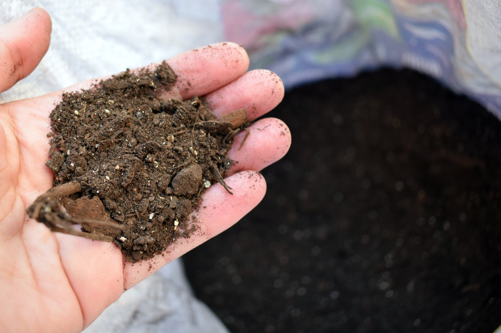

El vermicompostaje no ocurre de un día para otro. En una vermicompostera doméstica, lo habitual es esperar varios meses antes de obtener una primera cosecha de humus de lombriz.

Como referencia general, una vermicompostera bien manejada puede producir humus aprovechable entre los 3 y 6 meses. El tiempo exacto depende de la temperatura, la cantidad de lombrices, el tamaño de los residuos, la humedad, la aireación y la frecuencia de alimentación.

Más que mirar el calendario, conviene aprender a reconocer las señales de madurez del material. El humus listo se ve oscuro, tiene textura suelta, huele a tierra húmeda y ya no permite reconocer la mayor parte de los residuos originales.

## 1. La respuesta corta

En condiciones domésticas, estos son los tiempos más comunes:

| Situación                      | Tiempo aproximado                             |
| ------------------------------ | --------------------------------------------- |
| Vermicompostera nueva          | 4 a 6 meses para la primera cosecha           |
| Vermicompostera ya establecida | 2 a 4 meses por bandeja o zona activa         |
| Residuos picados o congelados  | Proceso más rápido                            |
| Residuos grandes y fibrosos    | Proceso más lento                             |
| Invierno o clima frío          | Proceso más lento                             |
| Verano con buena sombra        | Proceso más rápido, si no hay exceso de calor |

Estos plazos son orientativos. Una vermicompostera no trabaja como una máquina con tiempos fijos. Es un ecosistema vivo.

## 2. Por qué la primera cosecha demora más

La primera cosecha suele ser la más lenta.

Esto ocurre porque la vermicompostera recién instalada todavía está formando su equilibrio biológico.

Durante las primeras semanas deben estabilizarse:

- La población de lombrices
- La comunidad microbiana
- La humedad de el sustrato
- La aireación del sustrato
- El ritmo de alimentación

Las lombrices no procesan los residuos solas. El vermicompostaje ocurre por la acción conjunta de lombrices y microorganismos. Primero los residuos son colonizados por bacterias y hongos. Luego las lombrices los fragmentan, digieren y transforman en un material más estable.

Por eso, una vermicompostera madura suele funcionar mejor que una recién armada.

## 3. Qué factores aceleran el proceso

El objetivo no es forzar la vermicompostera, sino darle condiciones estables.

El proceso suele avanzar más rápido cuando:

- Hay suficientes lombrices
- Los residuos se agregan en trozos pequeños
- La humedad es similar a una esponja estrujada.
- Hay buena ventilación
- Se incorpora material seco
- La temperatura se mantiene moderada
- No se sobrealimenta el sistema

También ayuda congelar los residuos antes de incorporarlos. Al congelarse, los tejidos vegetales se rompen y luego se ablandan al descongelarse. Esto facilita el trabajo de los microorganismos y acelera la descomposición.

## 4. Qué factores lo vuelven más lento

El vermicompostaje se ralentiza cuando las condiciones dejan de ser cómodas para las lombrices o para los microorganismos aeróbicos.

Los factores más comunes son:

- Frío
- Sequedad
- Exceso de humedad
- Falta de oxígeno
- Residuos muy grandes
- Exceso de cítricos, café u otros materiales irritantes.
- Poca población de lombrices
- Sobrealimentación

Una vermicompostera saturada de comida no procesa más rápido. Procesa peor.

Cuando hay demasiado alimento acumulado, aumenta la humedad, baja el oxígeno y pueden aparecer malos olores. En ese ambiente las lombrices reducen su actividad o intentan migrar.

## 5. Cómo saber si el proceso va bien

No necesitas medir todo con instrumentos.

Una vermicompostera saludable muestra señales bastante claras:

- Olor a tierra húmeda
- Ausencia de olor a podrido
- Residuos que disminuyen con el tiempo
- Lombrices activas dentro del sustrato
- Humedad constante, pero sin exceso de líquido
- Material cada vez más oscuro y uniforme

Si al abrir la vermicompostera encuentras una mezcla húmeda, aireada y sin malos olores, el proceso probablemente va bien aunque todavía no haya humus listo para cosechar.

## 6. Cómo reconocer el humus maduro

El humus de lombriz listo tiene características muy distintas a los residuos frescos.

Deberías observar:

- Color café oscuro o negro
- Textura granular
- Olor agradable a tierra húmeda
- Baja presencia de restos reconocibles
- Material suelto, no pastoso
- Menor cantidad de lombrices en esa zona si ya migraron hacia alimento nuevo.

Si todavía ves trozos grandes de frutas, verduras o papel muy fresco, falta tiempo.

No es necesario que todo esté perfectamente fino. Algunos restos de cartón, ramas pequeñas o fibras pueden volver a la vermicompostera después del harneado.

## 7. Etapas del vermicompostaje doméstico

El proceso puede entenderse en cuatro etapas.

### Etapa 1: adaptación

Ocurre durante las primeras semanas.

Las lombrices exploran el nuevo ambiente y se ajustan a el sustrato inicial.

En esta etapa conviene alimentar poco.

### Etapa 2: actividad creciente

La población microbiana aumenta y los residuos comienzan a descomponerse con más velocidad.

Las lombrices se concentran en las zonas con alimento.

### Etapa 3: transformación visible

El material empieza a oscurecerse y los residuos originales se vuelven menos reconocibles.

La vermicompostera procesa más rápido que al inicio.

### Etapa 4: maduración

El material se vuelve más estable, oscuro y homogéneo.

En sistemas de bandejas, las lombrices suelen migrar hacia una bandeja con alimento más fresco.

## 8. Cómo acelerar sin dañar el sistema

Puedes acelerar el proceso con buenas prácticas, no con atajos agresivos.

Funciona bien:

- Picar los residuos
- Congelarlos antes de agregarlos
- Alimentar en capas delgadas
- Cubrir siempre con material seco
- Mantener sombra y temperatura estable
- Revisar humedad con la prueba del puño
- No agregar más comida hasta que la anterior vaya desapareciendo.

No conviene:

- Agregar exceso de alimento
- Exponer la compostera al sol para "activar" el proceso.
- Incorporar fertilizantes químicos
- Revolver todo el sistema con frecuencia
- Saturar con agua
- Usar cal o ceniza sin diagnóstico claro

El proceso mejora con estabilidad, no con intervenciones constantes.

## 9. Cuánto demora según el tipo de residuo

No todos los residuos se degradan al mismo ritmo.

| Residuo                          | Velocidad aproximada |
| -------------------------------- | -------------------- |
| Sandía, melón, lechuga           | Rápida               |
| Plátano, zapallo, tomate         | Media                |
| Papa, zanahoria, cáscaras firmes | Media a lenta        |
| Cartón picado                    | Lenta                |
| Hojas secas enteras              | Lenta                |
| Ramas, cuescos, cáscaras duras   | Muy lenta            |

Los materiales lentos no son necesariamente malos. Muchos cumplen una función estructural y ayudan a mantener aireación.

El problema aparece cuando la vermicompostera recibe demasiados residuos difíciles de procesar y poca comida blanda.

## 10. Recomendación rápida

Si estás comenzando, espera entre 4 y 6 meses antes de planificar tu primera cosecha.

Durante ese tiempo, alimenta con moderación, incorpora siempre material seco y observa cómo cambia el sustrato.

Después de la primera cosecha, la vermicompostera suele volverse más eficiente. La colonia ya está adaptada, la microbiota es más estable y el manejo resulta más fácil.

## Errores comunes

| Error                          | Consecuencia                |
| ------------------------------ | --------------------------- |
| Esperar humus en pocas semanas | Cosecha inmadura            |
| Sobrealimentar para acelerar   | Malos olores y mosquitas    |
| No picar residuos grandes      | Descomposición lenta        |
| Dejar secar el sistema         | Baja actividad de lombrices |
| Mantener exceso de humedad     | Falta de oxígeno            |
| Cosechar solo por fecha        | Humus incompleto            |

## Preguntas frecuentes

### ¿Cuánto demora la primera cosecha de humus?

En una vermicompostera doméstica nueva, normalmente entre 4 y 6 meses.

### ¿Por qué mi vermicompostera avanza lento?

Puede haber frío, poca población de lombrices, residuos muy grandes, exceso de humedad, falta de aireación o alimentación excesiva.

### ¿Puedo cosechar antes de los 3 meses?

Solo si el material ya está oscuro, estable y con pocos restos reconocibles. En la mayoría de los casos domésticos conviene esperar más.

### ¿El verano acelera el vermicompostaje?

Sí, hasta cierto punto. El calor moderado aumenta la actividad biológica, pero el exceso de temperatura puede estresar o matar lombrices.

### ¿El invierno detiene el proceso?

No necesariamente. En la zona central de Chile suele continuar, pero más lento. En zonas frías puede reducirse bastante.

### ¿Cómo sé que el humus está listo?

Debe tener color oscuro, textura suelta, olor a tierra húmeda y muy pocos residuos reconocibles.

---

Imagen de portada por [Oregon State University](https://www.flickr.com/photos/oregonstateuniversity/28866055336) (CC BY-SA).
