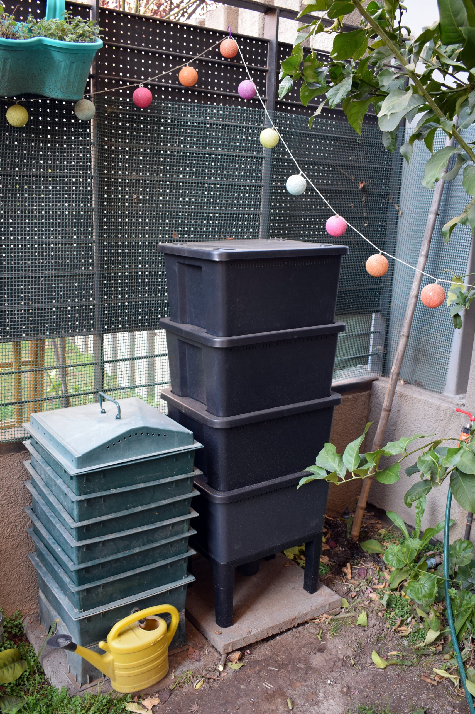
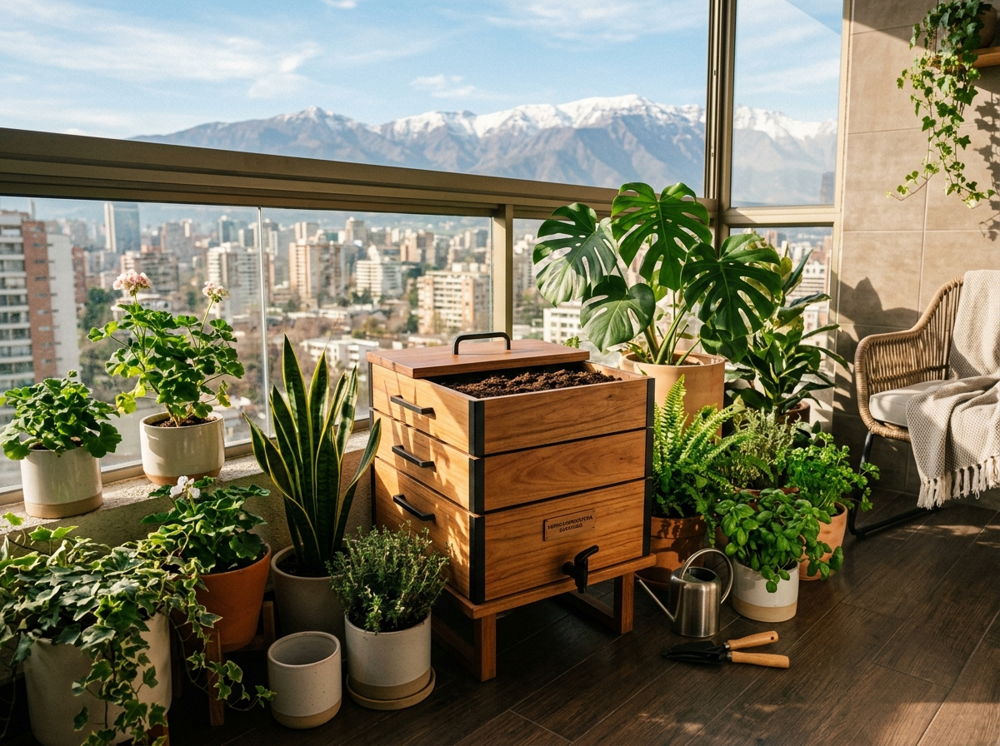
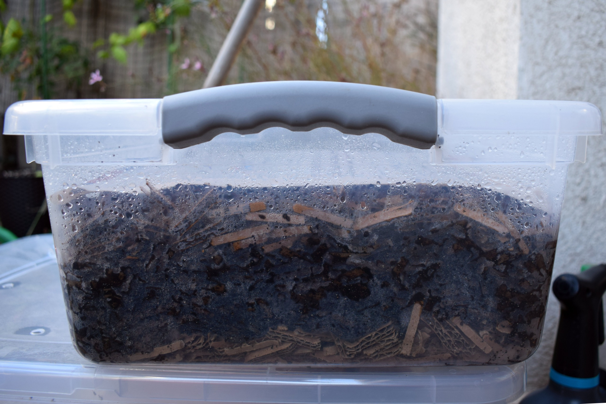

Elegir una vermicompostera no consiste en comprar el modelo más bonito ni el más grande. La mejor opción es la que puedes mantener estable en tu espacio real, con tus residuos reales y tu clima real.

Una vermicompostera funciona bien cuando permite tres cosas: buena aireación, humedad controlada y acceso fácil para alimentar, revisar y cosechar. Si falla en cualquiera de esos puntos, aparecen los problemas típicos: malos olores, exceso de líquido, mosquitas o fuga de lombrices.

En esta guía aprenderás qué tipos de vermicompostera existen, cuál conviene para departamento, patio o casa, qué tamaño elegir y qué detalles revisar antes de comprar o fabricar una.

## 1. Qué debe tener una buena vermicompostera

Una buena vermicompostera no necesita ser compleja.

Debe cumplir con cinco condiciones básicas:

- Tener ventilación suficiente
- Mantener humedad sin quedar inundada
- Proteger a las lombrices del sol directo
- Permitir agregar alimento sin revolver todo el sistema.
- Facilitar la cosecha del humus

Las lombrices rojas californianas viven en la materia orgánica superficial. No necesitan un recipiente profundo como una macetero, sino un ambiente amplio, húmedo, aireado y protegido.

Por eso, una caja baja y bien ventilada suele funcionar mejor que un recipiente muy profundo y cerrado.

## 2. Tipos de vermicompostera

Existen varios diseños. Ninguno es perfecto para todos los casos.

La elección depende del espacio disponible, la cantidad de residuos y el nivel de manejo que quieras asumir.

### Vermicompostera de bandejas

Es el modelo más común en departamentos.

Consiste en varias bandejas apiladas. Las lombrices procesan los residuos en una bandeja y luego migran hacia la siguiente cuando encuentran alimento nuevo.

Sus ventajas:

- Ocupa poco espacio
- Es limpia y ordenada
- Facilita la cosecha por bandejas
- Funciona bien en balcones, logias y cocinas ventiladas.

Sus desventajas:

- Tiene menos inercia térmica
- Puede secarse o calentarse rápido si queda expuesta.
- Requiere cuidar bien la humedad

Es una buena opción para una o dos personas que viven en departamento y producen una cantidad moderada de residuos vegetales.

### Vermicompostera de una sola caja

Es el sistema más simple.

Puede ser una caja plástica, un cajón de madera o un contenedor adaptado con perforaciones.

Sus ventajas:

- Es barata
- Es fácil de fabricar
- Permite observar bien el proceso
- Tiene menos piezas que limpiar

Sus desventajas:

- La cosecha puede ser más manual
- Es más fácil sobrealimentar si no hay experiencia.
- Necesita buen drenaje y ventilación

Es una buena opción para comenzar si quieres aprender el proceso antes de invertir en un sistema más elaborado.

### Vermicompostera continua

Es un sistema donde el alimento entra por arriba y el humus maduro se retira por abajo.

Suele usarse en formatos más grandes o semiartesanales.

Sus ventajas:

- Permite cosechas más cómodas
- Mantiene zonas con distinto grado de descomposición
- Puede procesar más residuos

Sus desventajas:

- Es más difícil de fabricar bien
- Requiere una estructura más firme
- No siempre conviene para espacios pequeños

Es una buena opción para casas con patio, comunidades, colegios o personas que ya tienen experiencia.

### Vermicompostera en sustrato o cajón grande

Es un sistema amplio, horizontal y con mayor volumen.

Sus ventajas:

- Tiene mejor estabilidad térmica
- Tolera mejor pequeños errores
- Permite una población grande de lombrices
- Es útil para casas con patio o huertos.

Sus desventajas:

- Ocupa más espacio
- No es ideal para departamentos
- Requiere protección contra lluvia, sol directo y animales.

Es una buena opción cuando hay patio, sombra y producción constante de residuos orgánicos.

## 3. Qué tamaño elegir

El tamaño debe responder a la cantidad de residuos que realmente vas a procesar.

No conviene elegir una vermicompostera enorme si recién estás aprendiendo. Tampoco conviene una demasiado pequeña si en tu casa se cocina todos los días y se generan muchos restos vegetales.

Como referencia práctica:

| Hogar               | Tamaño recomendado | Tipo sugerido                      |
| ------------------- | ------------------ | ---------------------------------- |
| 1 persona           | Pequeña            | Bandejas o caja simple             |
| 2 personas          | Pequeña a mediana  | Bandejas                           |
| 3 a 4 personas      | Mediana            | Bandejas grandes o cajón           |
| 5 o más personas    | Mediana a grande   | Cajón, sustrato o sistema continuo |
| Comunidad o colegio | Grande             | Sustrato o sistema continuo        |

Esta tabla es solo una guía. La capacidad real depende de la dieta, la frecuencia de cocina y la cantidad de material seco disponible.

Una familia que cocina muchas verduras puede generar más residuos útiles que una familia más grande que come principalmente fuera de casa.

## 4. Plástico, madera o material reciclado

El material del contenedor influye en la temperatura, la humedad y la durabilidad.

### Plástico

Es el material más común en vermicomposteras urbanas.

Ventajas:

- Liviano
- Fácil de limpiar
- Resistente a la humedad
- Bueno para espacios interiores o semiinteriores

Desventajas:

- Puede calentarse mucho al sol
- Si tiene poca ventilación, acumula humedad
- Puede condensar agua en la tapa

Si eliges plástico, prioriza colores claros o mantén el contenedor siempre a la sombra.

### Madera

La madera permite mejor respiración del sistema y regula mejor algunos excesos de humedad.

Ventajas:

- Buena aireación
- Menor condensación
- Mejor integración en patios o huertos

Desventajas:

- Se degrada con el tiempo
- Puede atraer termitas si está en contacto con suelo húmedo.
- Requiere más mantención

Es una buena opción para patios, pero no siempre para interiores.

### Baldes o cajas recicladas

Pueden funcionar bien si están correctamente adaptados.

Lo importante es agregar:

- Perforaciones laterales
- Perforaciones superiores
- Drenaje inferior si el sistema lo requiere
- Una bandeja o base para recoger exceso de humedad.
- Tapa que proteja sin sellar herméticamente

Una caja reciclada mal ventilada suele causar más problemas que una vermicompostera comercial simple.

## 5. Ventilación y drenaje

La ventilación es más importante que el drenaje.

Una vermicompostera no debería producir líquido constantemente. Si chorrea, normalmente hay exceso de humedad o falta de material seco.

Busca un sistema que permita entrada de aire por distintos puntos:

- Laterales
- Tapa
- Separaciones entre bandejas
- Pequeñas perforaciones protegidas

El drenaje puede ayudar en emergencias, pero no debe reemplazar el buen manejo de la humedad.

Si el sistema incluye llave inferior, úsala como señal de diagnóstico. No como objetivo. Una vermicompostera equilibrada produce poco o nada de lixiviado.

## 6. Qué modelo conviene según el lugar

### Departamento

Conviene una vermicompostera de bandejas o una caja compacta.

Prioriza:

- Tamaño pequeño o mediano
- Tapa firme
- Buena ventilación
- Fácil acceso
- Base segura para evitar derrames

La mejor ubicación suele ser una logia, balcón protegido o cocina ventilada.

Evita balcones con sol directo de tarde, especialmente en verano.

### Casa con patio

Puedes usar bandejas, cajas grandes o sustratos horizontales.

Prioriza:

- Sombra permanente
- Protección contra lluvia
- Buena ventilación
- Acceso cómodo para alimentar y cosechar

En patios, el principal riesgo suele ser la exposición al sol, la lluvia directa o el ingreso de animales.

### Huerto urbano o comunidad

Conviene un sistema más grande, idealmente horizontal o continuo.

Prioriza:

- Manejo simple
- Acceso para varias personas
- Protección física
- Señalética clara
- Reglas de alimentación

En sistemas comunitarios, el problema principal no suele ser técnico. Suele ser de manejo: demasiadas personas agregando residuos sin criterio común.

## 7. Consideraciones para el clima chileno

En Chile no hay una sola respuesta. No es lo mismo elegir una vermicompostera para Arica, Santiago, Valdivia o Punta Arenas.

### Zona norte

El riesgo principal es la sequedad y el exceso de temperatura.

Conviene:

- Ubicar siempre a la sombra
- Evitar recipientes negros
- Revisar humedad con frecuencia
- Usar más material que retenga agua, como cartón hidratado o fibra vegetal.

### Zona central

El principal desafío es el verano.

Conviene:

- Evitar el sol de poniente
- No sobrealimentar durante olas de calor
- Mantener buena ventilación
- Proteger la vermicompostera del calor acumulado en balcones y terrazas.

### Zona sur

El principal desafío es el exceso de lluvia y frío.

Conviene:

- Proteger de lluvia directa
- Usar tapa efectiva pero ventilada
- Evitar que el sistema se sature de agua.
- Asumir que el proceso será más lento en invierno.

### Zonas frías o cordilleranas

El proceso puede continuar, pero más lento.

Conviene:

- Ubicar la vermicompostera en un lugar protegido
- Usar mayor volumen de material para estabilizar temperatura.
- Reducir la alimentación durante los períodos más fríos.

## 8. Señales de una mala elección

Una vermicompostera mal elegida no siempre falla de inmediato. A veces funciona durante algunas semanas y luego se vuelve difícil de manejar.

Algunas señales de alerta:

- Se calienta demasiado durante el día
- Siempre acumula líquido en la base
- Es difícil retirar el humus
- No puedes revisar el interior con comodidad
- Tiene poca ventilación
- Es demasiado pequeña para tus residuos
- Es demasiado grande para tu espacio
- Te obliga a mover mucho peso cada vez que la usas.

La mejor vermicompostera es la que puedes revisar y mantener sin esfuerzo excesivo.

## 9. Errores comunes al elegir una vermicompostera

| Error                                      | Consecuencia                                             |
| ------------------------------------------ | -------------------------------------------------------- |
| Comprar una demasiado pequeña              | Se sobrealimenta y se satura rápido                      |
| Comprar una demasiado grande               | Cuesta mantener humedad y temperatura estables al inicio |
| Elegir un recipiente sin ventilación       | Malos olores y falta de oxígeno                          |
| Dejarla al sol directo                     | Estrés térmico o muerte de lombrices                     |
| Confiar demasiado en la llave de lixiviado | Se normaliza el exceso de humedad                        |
| No considerar la cosecha                   | El sistema se vuelve incómodo con el tiempo              |

## 10. Recomendación rápida

Si vives en departamento, elige una vermicompostera de bandejas pequeña o mediana, fácil de abrir, con buena ventilación y protegida del sol directo.

Si vives en casa con patio, puedes elegir una caja más grande o un sustrato horizontal, siempre que esté bajo sombra y protegida de la lluvia.

Si estás comenzando, prioriza simplicidad. Una vermicompostera fácil de manejar es mejor que un sistema grande que no podrás revisar ni cosechar bien.

## Preguntas frecuentes

### ¿Cuál es la mejor vermicompostera para empezar?

Para la mayoría de las personas, una vermicompostera pequeña o mediana de bandejas es suficiente. Ocupa poco espacio y permite aprender el proceso con menor riesgo.

### ¿Sirve una caja plástica común?

Sí, si tiene buena ventilación, drenaje controlado y una tapa que proteja sin sellar completamente el sistema.

### ¿Necesito una vermicompostera con llave?

No necesariamente. La llave puede servir para retirar exceso de líquido, pero no debería producirse lixiviado en grandes cantidades. Si ocurre, el sistema está demasiado húmedo.

### ¿Es mejor una vermicompostera grande?

No siempre. Un sistema grande permite procesar más residuos, pero también requiere más material seco, más lombrices y más manejo.

### ¿Puedo dejar la vermicompostera en el balcón?

Sí, siempre que no reciba sol directo fuerte ni quede expuesta a lluvia intensa. En Chile central, el sol de la tarde puede calentar demasiado el contenedor.

### ¿Madera o plástico?

El plástico es más práctico para departamentos. La madera puede funcionar muy bien en patios, pero requiere más cuidado frente a humedad y deterioro.
