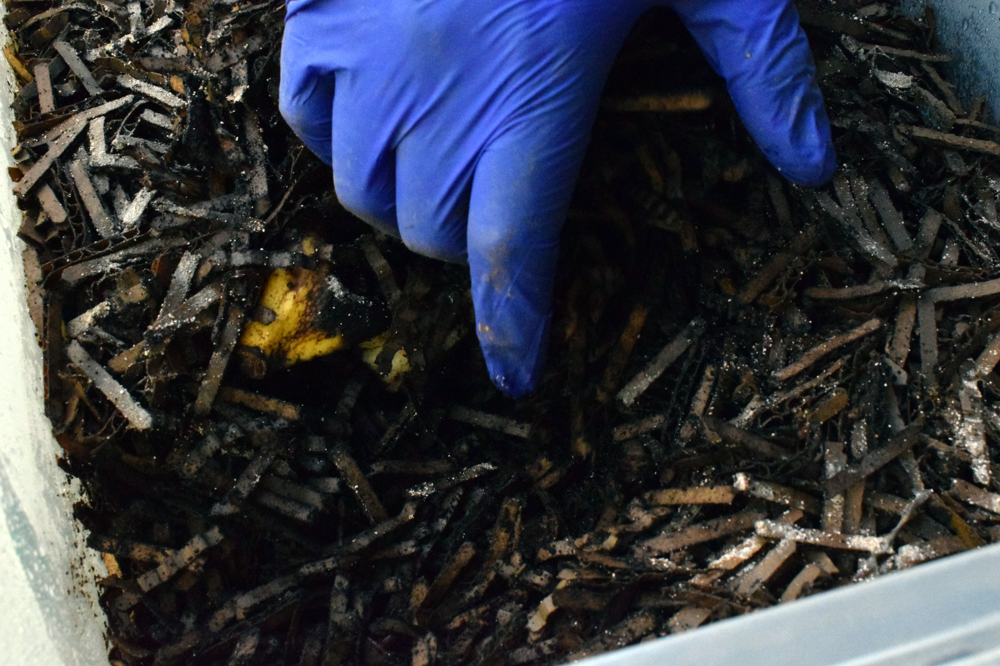

Encontrar hormigas cerca de una vermicompostera no siempre significa que el sistema esté fallando. A veces solo están explorando. Pero si empiezan a entrar en grandes cantidades, formar caminos estables o instalarse dentro del sustrato, conviene actuar.

Las hormigas suelen aparecer por tres razones: alimento expuesto, exceso de residuos dulces o un sustrato demasiado seco. En una vermicompostera bien manejada, húmeda y con los residuos cubiertos, normalmente no encuentran condiciones atractivas para establecerse.

La solución no es aplicar insecticidas. La prioridad es corregir el ambiente para que deje de ser cómodo para las hormigas sin dañar a las lombrices.

## 1. Por qué llegan hormigas a la vermicompostera

Las hormigas llegan porque detectan alimento disponible.

Les atraen especialmente:

- frutas dulces expuestas;
- restos de sandía, melón o plátano;
- residuos sin cubrir;
- bordes pegajosos;
- superficies con lixiviado o jugos;
- alimento acumulado por sobrealimentación.

También pueden aparecer si el sustrato está demasiado seco. Muchas especies de hormigas prefieren ambientes menos húmedos que las lombrices. Cuando una vermicompostera pierde humedad, puede volverse más atractiva para ellas.

Por eso, la presencia de hormigas puede ser una señal útil: algo en la alimentación, humedad o limpieza externa necesita ajuste.

## 2. Cuándo son un problema

Una o dos hormigas explorando no son una emergencia.

El problema aparece cuando:

- ves caminos constantes hacia la vermicompostera;
- hay muchas hormigas dentro del sustrato;
- empiezan a concentrarse alrededor de residuos dulces;
- encuentras huevos o larvas de hormiga dentro del sistema;
- las lombrices se alejan de una zona ocupada;
- la colonia de hormigas parece instalada.

En ese punto, la vermicompostera está ofreciendo alimento, refugio o sequedad suficiente para que las hormigas permanezcan.

## 3. Revisa primero la humedad

La humedad es la primera variable que debes revisar.

Haz la prueba del puño:

1. Toma un puñado de material desde la zona activa.
2. Apriétalo con fuerza.
3. Observa la respuesta.

| Resultado                      | Interpretación           |
| ------------------------------ | ------------------------ |
| Se desarma y se siente seco    | Falta humedad            |
| Mantiene forma y casi no gotea | Humedad adecuada         |
| Gotea mucho                    | Exceso de humedad        |
| Se siente como barro           | Exceso severo de humedad |

Si el sustrato está seco, humedece gradualmente con un pulverizador o agrega cartón previamente hidratado.

No inundes la vermicompostera para eliminar hormigas. El exceso de agua puede causar falta de oxígeno y estrés para las lombrices.

## 4. Retira alimento expuesto

El segundo paso es revisar la superficie.

Busca restos dulces o muy visibles:

- cáscaras de fruta;
- restos de melón o sandía;
- plátano;
- comida acumulada;
- residuos pegados en los bordes;
- frutas parcialmente fermentadas.

Retira lo que esté claramente invadido por hormigas.

Luego cubre el alimento restante con una capa generosa de material seco:

- cartón corrugado picado;
- cajas de huevo;
- papel sin plastificar;
- hojas secas;
- fibra vegetal.

Los residuos frescos no deberían quedar visibles en la superficie.

Cubrir la comida reduce hormigas, mosquitas y malos olores al mismo tiempo.

## 5. Suspende alimentos muy dulces por algunos días

Si hay muchas hormigas, pausa temporalmente los residuos que más las atraen.

Durante una o dos semanas evita agregar:

- sandía;
- melón;
- uvas;
- mango;
- plátano muy maduro;
- restos de jugos;
- grandes cantidades de fruta.

Prefiere residuos menos azucarados y en porciones pequeñas, como:

- hojas de lechuga;
- acelga;
- restos de verduras;
- zapallo;
- cáscaras de papa en poca cantidad;
- cartón húmedo.

Cuando la actividad de hormigas disminuya, puedes volver a incorporar frutas, siempre bien enterradas y cubiertas.

## 6. Crea una barrera física

Si las hormigas siguen entrando desde el exterior, usa una barrera física.

Opciones simples:

- poner las patas o base de la vermicompostera dentro de recipientes con agua;
- ubicar la vermicompostera sobre una bandeja aislada;
- limpiar el camino de hormigas con agua y jabón;
- separar el contenedor de muros, plantas o muebles que funcionen como puente;
- revisar que ramas o cables no toquen la vermicompostera.

Una barrera con agua puede ser efectiva, pero debe usarse con cuidado.

Evita que el agua se convierta en criadero de mosquitos. Cámbiala con frecuencia y mantenla limpia.

## 7. Qué productos no usar

No apliques insecticidas dentro de la vermicompostera.

Evita:

- venenos para hormigas;
- aerosoles insecticidas;
- cloro;
- detergentes dentro del sustrato;
- ácido bórico;
- tierra de diatomeas directamente sobre las lombrices;
- aceites esenciales;
- ceniza o cal sin diagnóstico.

Muchos productos que matan hormigas también pueden dañar a las lombrices, alterar la microbiota o contaminar el humus.

La vermicompostera es un sistema biológico. Las soluciones deben corregir el ambiente, no envenenarlo.

## 8. Qué hacer si las hormigas ya instalaron un nido

Si encuentras un nido dentro de la vermicompostera, actúa con más cuidado.

Pasos recomendados:

1. Suspende la alimentación.
2. Retira la zona más invadida si puedes hacerlo sin perder demasiadas lombrices.
3. Devuelve las lombrices visibles al sistema.
4. Humedece gradualmente el sustrato restante.
5. Agrega material seco húmedo para recuperar estructura.
6. Limpia el exterior del contenedor.
7. Instala una barrera física.
8. Observa durante varios días antes de volver a alimentar normalmente.

Si el nido está muy extendido, puede ser necesario separar manualmente una fracción sana de lombrices y reiniciar el sistema con un sustrato nueva.

No es lo más común, pero puede ocurrir cuando la vermicompostera estuvo seca por mucho tiempo.

## 9. Cómo prevenir hormigas a largo plazo

La prevención se basa en manejo estable.

Mantén estas prácticas:

- cubre siempre los residuos;
- evita frutas dulces expuestas;
- limpia bordes y bandejas;
- controla la humedad;
- no sobrealimentes;
- usa material seco en cada alimentación;
- revisa la base y el entorno del contenedor;
- evita que plantas o muros sirvan de puente.

En verano, revisa con más frecuencia. El calor aumenta la actividad de hormigas y también puede secar más rápido la vermicompostera.

## 10. Recomendación rápida

Si aparecen hormigas, revisa humedad y alimento expuesto.

La mayoría de los casos se corrige con cuatro acciones:

1. Retirar residuos invadidos.
2. Humedecer si el sustrato está seco.
3. Cubrir toda la comida con material seco.
4. Instalar una barrera física si entran desde afuera.

No uses insecticidas dentro de la vermicompostera.

## Errores comunes

| Error                          | Consecuencia                                |
| ------------------------------ | ------------------------------------------- |
| Dejar fruta dulce expuesta     | Atrae hormigas rápidamente                  |
| Mantener el sustrato seco      | Facilita que se instalen                    |
| Aplicar insecticida            | Puede matar lombrices y contaminar el humus |
| Inundar la vermicompostera     | Falta de oxígeno y estrés                   |
| No limpiar caminos de hormigas | Vuelven al mismo punto                      |
| Alimentar demasiado            | Más alimento disponible para plagas         |

## Preguntas frecuentes

### ¿Las hormigas matan a las lombrices?

No siempre. Pero una invasión grande puede estresar a la colonia, competir por alimento y ocupar zonas de la vermicompostera.

### ¿Por qué aparecen hormigas si mi vermicompostera no huele mal?

Pueden llegar por residuos dulces, restos expuestos o sequedad. No siempre están asociadas a mal olor.

### ¿Puedo usar veneno para hormigas cerca de la vermicompostera?

No lo uses dentro del sistema. Si aplicas algún control externo, evita cualquier contacto con el sustrato, las lombrices o el humus.

### ¿Sirve poner agua alrededor de la base?

Sí, como barrera física. Debe mantenerse limpia y sin transformarse en criadero de mosquitos.

### ¿Debo cambiar todo el sustrato?

Solo si las hormigas instalaron un nido grande y no puedes controlarlas corrigiendo humedad, alimento y acceso.

### ¿La presencia de hormigas significa que la vermicompostera está seca?

No siempre, pero es una causa frecuente. Haz la prueba del puño antes de corregir.
