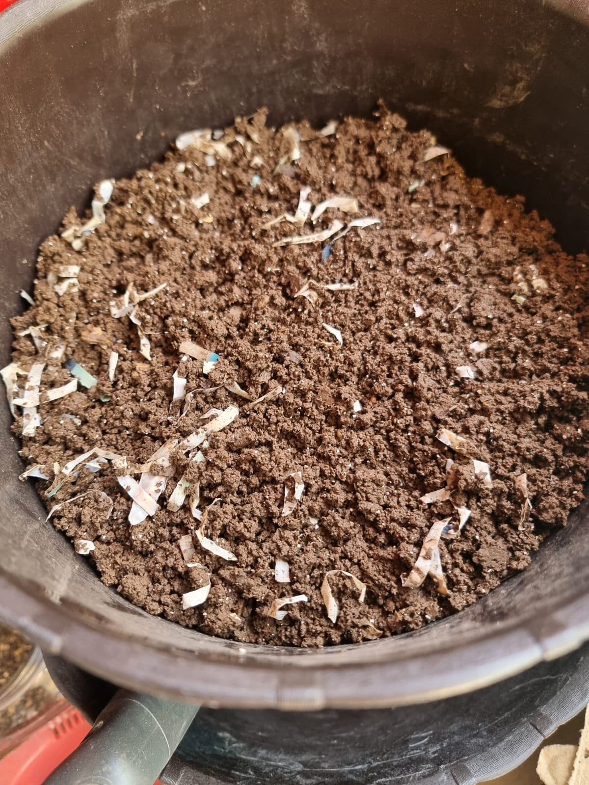
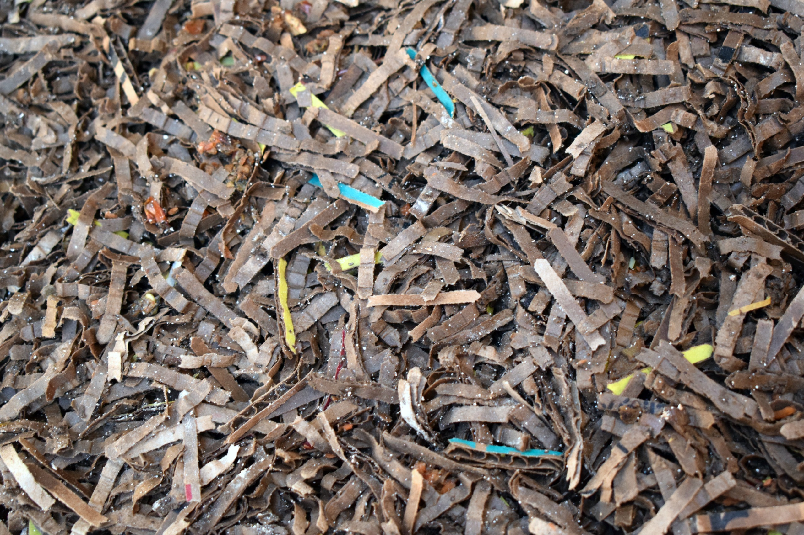
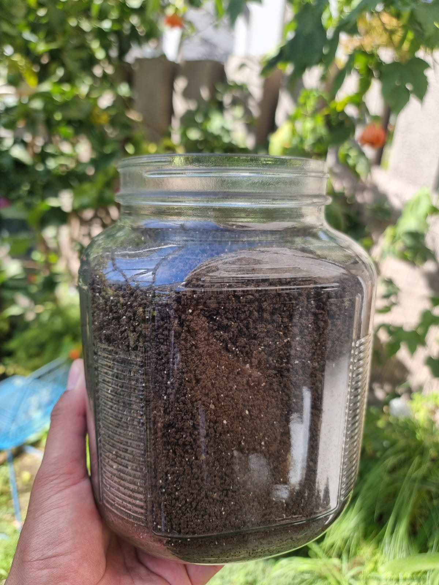

Encontrar plásticos, etiquetas, cintas adhesivas u otros residuos en el humus de lombriz es frustrante, pero tiene solución parcial. Lo importante es actuar con criterio: separar lo visible, evaluar el nivel de contaminación y evitar que el problema vuelva a ocurrir.

Una vermicompostera transforma materia orgánica. No transforma plástico, vidrio, metales, recubrimientos brillantes ni adhesivos en humus. Esos materiales pueden fragmentarse y mezclarse con el sustrato, pero no se degradan de forma útil en una vermicompostera doméstica.

Por eso la prevención es mucho más efectiva que la corrección. Una vez que el plástico está mezclado con el humus, puedes retirar una parte, pero no siempre podrás eliminarlo por completo.

## 1. Primero identifica qué tipo de contaminación hay

No todos los residuos tienen el mismo nivel de riesgo.

Antes de decidir qué hacer, observa el material contaminante.

| Material encontrado            | Nivel de preocupación           |
| ------------------------------ | ------------------------------- |
| Trozos grandes de plástico     | Alto, pero removible            |
| Cinta adhesiva                 | Alto, removible si está visible |
| Etiquetas autoadhesivas        | Alto, pueden fragmentarse       |
| Papel brillante o plastificado | Medio a alto                    |
| Vidrio                         | Alto por riesgo físico          |
| Metales pequeños               | Alto por riesgo físico          |
| Piedras o ramas                | Bajo, si están limpias          |
| Cartón parcialmente degradado  | Bajo                            |
| Cáscaras duras o semillas      | Bajo                            |

El cartón sin terminar de descomponer no es contaminación. Puede volver a la vermicompostera.

El plástico, en cambio, no debe volver al sistema.

## 2. Qué hacer si ves plásticos grandes

Si los plásticos son visibles, retíralos manualmente.

Hazlo antes de harnear o aplicar el humus.

Pasos:

1. Extiende el humus sobre una lona, bandeja o mesa.
2. Trabaja con buena luz
3. Retira trozos visibles de plástico, cinta, etiquetas o envases.
4. Separa también vidrio, metales o materiales cortantes
5. Revisa el material por capas, no solo la superficie.
6. Guarda el humus limpio en un recipiente aireado.

No mezcles el material contaminado con una cosecha limpia. Es mejor aislarlo y revisarlo con calma.

Si hay muchos fragmentos visibles, trata esa tanda como humus de uso restringido.

## 3. Harnear ayuda, pero no resuelve todo

El harneado sirve para separar partículas por tamaño.

Puede ayudarte a retirar:

- Trozos grandes de plástico
- Ramas
- Cartón no degradado
- Piedras
- Etiquetas enteras
- Restos de cáscaras duras

Pero tiene una limitación importante: si el plástico se fragmentó en pedazos pequeños, puede pasar por la malla junto con el humus fino.

Por eso el harneado no elimina microplásticos ni partículas muy pequeñas.

Aun así, conviene harnear una tanda contaminada, porque reduce parte del problema y permite revisar mejor el material retenido.

## 4. Qué hacer con el material retenido en el harnero

Después de harnear, el material retenido debe revisarse con cuidado.

Sepáralo en tres grupos.

| Grupo                                  | Qué hacer                            |
| -------------------------------------- | ------------------------------------ |
| Lombrices y capullos                   | Devolver a la vermicompostera        |
| Cartón limpio, hojas o ramas pequeñas  | Devolver a la vermicompostera        |
| Plásticos, etiquetas, vidrio o metales | Retirar y desechar fuera del sistema |

No devuelvas todo automáticamente a la vermicompostera.

El material grueso suele contener lombrices y capullos, pero también puede concentrar fragmentos de plástico. Revisa antes de reintegrarlo.

## 5. Qué hacer si el plástico está muy fragmentado

Si el plástico se rompió en muchos pedazos pequeños, la corrección es más limitada.

En ese caso:

- No uses ese humus en almácigos
- No lo uses en plantas comestibles
- No lo mezcles con sustratos limpios
- No lo vendas ni lo regales como humus de buena calidad.
- No lo devuelvas a la vermicompostera

Puedes reservarlo para usos de bajo riesgo, como mejorar suelo ornamental no comestible, siempre que no haya vidrio, metales, pilas, químicos, pinturas o materiales peligrosos.

Si la contaminación es alta, lo más responsable es desechar esa tanda.

No vale la pena distribuir plástico molido en maceteros, huertos o jardines por intentar aprovechar una cosecha.

## 6. Qué hacer si hay vidrio, metales o materiales cortantes

Si encuentras vidrio, alambres, grapas grandes, latas fragmentadas o metales cortantes, maneja el humus con más cuidado.

Usa guantes.

No lo apliques en:

- Maceteros de interior
- Huertos
- Almácigos
- Zonas donde niños o mascotas puedan manipular el suelo.
- Jardineras pequeñas

Si no puedes retirar todos los fragmentos con seguridad, descarta el material.

El riesgo físico es más importante que el valor del humus.

Las lombrices pueden sobrevivir entre materiales duros, pero eso no significa que el producto final sea seguro para usar.

## 7. Qué hacer si el humus tiene restos de papel brillante

El papel brillante o plastificado es más difícil de manejar porque puede deshacerse en láminas pequeñas.

Si encuentras algunos trozos grandes:

- Retíralos manualmente
- Harnea el humus
- Revisa el material retenido
- Evita usar esa tanda en almácigos o cultivos comestibles sensibles.

Si el material brillante está muy distribuido, considera esa cosecha como contaminada.

El problema de los papeles recubiertos es que no siempre se ve claramente qué parte es fibra vegetal y qué parte es recubrimiento. En caso de duda, es mejor restringir el uso del humus.

## 8. ¿Se puede "limpiar" el humus contaminado?

Solo parcialmente.

Puedes retirar residuos visibles. Puedes harnear. Puedes separar manualmente.

Pero no puedes garantizar que un humus con plástico fragmentado quede completamente limpio.

Una vermicompostera doméstica no tiene un proceso que destruya plásticos ni recubrimientos sintéticos. Tampoco alcanza condiciones industriales para degradar muchos materiales vendidos como biodegradables o compostables.

Por eso, si el humus está contaminado, la decisión depende del grado del problema.

| Situación                          | Decisión recomendada                            |
| ---------------------------------- | ----------------------------------------------- |
| Pocos trozos grandes y removibles  | Retirar, harnear y usar con normalidad          |
| Varias etiquetas o cintas visibles | Retirar, harnear y usar con precaución          |
| Plástico muy fragmentado           | Uso restringido o descarte                      |
| Vidrio o metales cortantes         | Descartar si no puedes retirarlos completamente |
| Material desconocido o químico     | Descartar                                       |

## 9. Cómo evitar que vuelva a pasar

La prevención ocurre antes de alimentar o preparar el sustrato.

Antes de agregar cualquier material, revisa:

- Que no tenga cinta adhesiva
- Que no tenga etiquetas
- Que no tenga recubrimiento brillante
- Que no tenga plástico adherido
- Que no tenga grapas, clips o alambres
- Que no tenga grasa, pintura ni químicos

Con el cartón, aplica esta regla:

Usa solo cartón simple, café, sin brillo y sin plastificado.

Retira todo lo demás.

También conviene mantener una bolsa o caja separada con materiales seguros para la vermicompostera. Así evitas improvisar con papeles o envases dudosos cuando necesitas material seco.

## 10. Recomendación rápida

Si encuentras plásticos en el humus, no los ignores.

Retira lo visible, harnea el material y evalúa si la contaminación es leve o severa.

Si son pocos trozos grandes, probablemente puedes limpiar la tanda y usarla.

Si el plástico está fragmentado, si hay vidrio o si aparecen materiales desconocidos, restringe el uso o descarta el humus.

El humus de lombriz debería mejorar el suelo. No debería convertirse en una vía para distribuir residuos persistentes en maceteros, huertos o jardines.

## Errores comunes

| Error                                              | Consecuencia                         |
| -------------------------------------------------- | ------------------------------------ |
| Harnear y asumir que todo quedó limpio             | Pueden pasar fragmentos pequeños     |
| Devolver etiquetas al sistema                      | La contaminación continúa            |
| Usar humus contaminado en almácigos                | Mayor exposición en un sustrato fino |
| Mezclar una tanda contaminada con humus limpio     | Contaminación de todo el lote        |
| Ignorar vidrio o metales pequeños                  | Riesgo físico al manipular           |
| Confiar en materiales "compostables" sin verificar | Fragmentos persistentes en el humus  |

## Preguntas frecuentes

### ¿Las lombrices comen plástico?

No. Las lombrices pueden mover o mezclar fragmentos, pero no transforman plástico en humus.

### ¿Puedo usar humus que tuvo algunos plásticos?

Si eran pocos trozos grandes y los retiraste completamente, puedes usarlo con precaución. Si el plástico está muy fragmentado, restringe su uso o descártalo.

### ¿El harnero elimina microplásticos?

No. El harnero ayuda con fragmentos grandes, pero no elimina partículas pequeñas que pasan junto con el humus fino.

### ¿Qué hago con el material retenido después de harnear?

Devuelve lombrices, capullos, cartón limpio y hojas secas a la vermicompostera. Retira plásticos, etiquetas, vidrio y metales.

### ¿Puedo usar humus contaminado en plantas ornamentales?

Solo si la contaminación es leve y no hay materiales peligrosos. Si hay plástico muy fragmentado, vidrio, metales o residuos desconocidos, es mejor no usarlo.

### ¿Cómo evito que vuelva a pasar?

Revisa todo antes de ingresarlo al sistema. Usa solo cartón café simple, cajas de huevo, papel sin brillo, hojas secas y materiales vegetales limpios.
