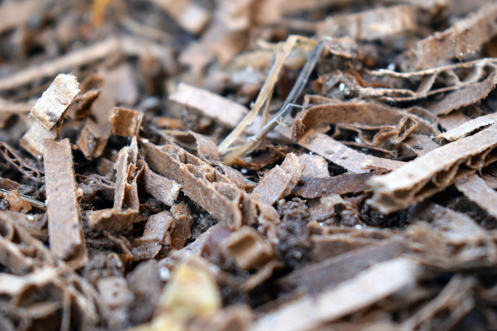
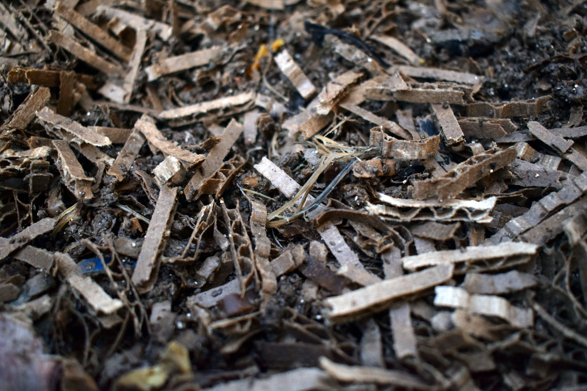
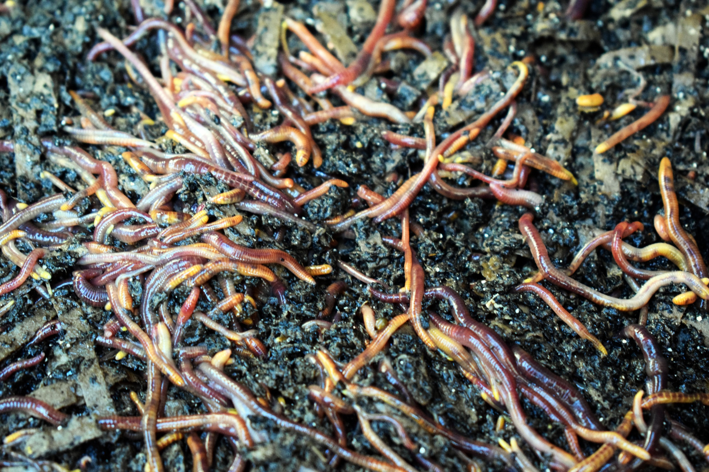

El sustrato es el primer hábitat de tus lombrices. No es solo una base para poner comida encima. Es el lugar donde la colonia respirará, se moverá, se protegerá de la luz, regulará humedad y empezará a transformar residuos orgánicos en humus.

Un sustrato bien preparado reduce la mayoría de los problemas iniciales: fugas, malos olores, exceso de humedad, compactación y baja actividad.

La idea es simple: antes de alimentar, debes crear un ambiente húmedo, aireado y estable. Las lombrices rojas californianas (_Eisenia fetida_) no viven directamente en restos frescos de cocina. Viven mejor en una mezcla de materiales vegetales parcialmente húmedos, ricos en carbono y colonizados por microorganismos.

## 1. Qué es el sustrato de una vermicompostera

El sustrato es la mezcla inicial donde vivirán las lombrices durante los primeros días y semanas.

Cumple varias funciones:

- Retiene humedad
- Permite circulación de aire
- Protege de cambios bruscos
- Diluye los residuos frescos
- Aporta carbono
- Sirve como refugio si alguna zona tiene demasiada comida, calor o acidez.

En una vermicompostera sana, las lombrices siempre deberían tener una zona segura donde retirarse.

Por eso no conviene llenar el sistema solo con restos de frutas y verduras. Ese material se descompone rápido, libera mucha humedad y puede volverse incómodo si se agrega en exceso.

## 2. Materiales recomendados

Los mejores materiales para preparar el sustrato son secos, fibrosos y capaces de retener agua sin convertirse en barro.

Puedes usar:

- Cartón corrugado sin plastificar
- Cajas de huevo de cartón
- Papel kraft
- Papel sin brillo
- Hojas secas
- Fibra de coco hidratada
- Humus maduro si ya tienes otra vermicompostera
- Una pequeña cantidad de compost maduro

El cartón corrugado es especialmente útil porque absorbe humedad y crea pequeños espacios de aire.

Las hojas secas también funcionan bien, pero conviene picarlas si están muy enteras o duras.

## 3. Materiales que conviene evitar

No todo material seco sirve para un sustrato inicial.

Evita usar:

- Papel plastificado
- Cartón con mucha tinta brillante
- Servilletas con grasa
- Tierra de jardín compacta
- Arena
- Aserrín en exceso
- Ceniza
- Cal
- Hojas tratadas con pesticidas
- Restos de poda leñosa en trozos grandes

La tierra no es necesaria. Las lombrices de compostaje viven en materia orgánica superficial, no en suelo mineral profundo.

Una pequeña cantidad de compost maduro puede ayudar a inocular microorganismos, pero llenar la vermicompostera con tierra pesada reduce la aireación y dificulta el manejo.

## 4. Cómo preparar la mezcla inicial

Puedes preparar un sustrato simple con materiales disponibles en casa.

Una mezcla doméstica útil puede incluir:

- 2 Partes de cartón corrugado picado
- 1 Parte de hojas secas picadas
- 1 Parte de fibra de coco hidratada o compost maduro.
- Un puñado pequeño de residuos vegetales blandos

No necesitas medir con precisión. Lo importante es lograr una textura liviana, húmeda y aireada.

El volumen inicial debería cubrir al menos varios centímetros de profundidad, suficiente para que las lombrices puedan enterrarse y evitar la luz.

En una vermicompostera de bandejas, prepara la primera bandeja con una capa generosa de sustrato antes de incorporar la colonia.

## 5. Cómo humedecer el sustrato

El sustrato debe quedar húmeda, pero no empapada.

Usa la prueba del puño:

1. Toma un puñado de la mezcla
2. Apriétalo con fuerza
3. Observa qué ocurre

| Resultado                      | Qué significa     |
| ------------------------------ | ----------------- |
| Se desarma y se siente seco    | Falta agua        |
| Mantiene forma y casi no gotea | Humedad adecuada  |
| Escurre agua fácilmente        | Exceso de humedad |
| Se siente como barro           | Falta aireación   |

Si está seca, agrega agua poco a poco.

Si está demasiado mojada, incorpora más cartón seco, hojas secas o cajas de huevo picadas.

No instales las lombrices en un sustrato saturado. El exceso de agua desplaza el oxígeno y puede provocar fugas durante las primeras noches.

## 6. Cuándo agregar las lombrices

Agrega las lombrices cuando el sustrato esté lista, húmeda y a temperatura ambiente.

No las pongas sobre residuos recién fermentados, compost caliente ni materiales con olor fuerte.

Para instalarlas:

1. Abre un espacio en el sustrato
2. Deposita las lombrices junto con el sustrato en el que venían.
3. Cubre suavemente con material húmedo
4. Deja la superficie protegida con cartón o papel húmedo.
5. Evita alimentar en exceso durante los primeros días.

No laves las lombrices antes de incorporarlas. El material en el que vienen contiene microorganismos útiles y ayuda a reducir el estrés del traslado.

## 7. Primeras alimentaciones

Durante la primera semana, alimenta muy poco.

La colonia necesita adaptarse al nuevo ambiente.

Puedes agregar una pequeña cantidad de residuos blandos, como:

- Cáscara de plátano picada
- Restos de lechuga
- Zapallo cocido sin aliños
- Cáscaras de papa en poca cantidad
- Borra de café en cantidad pequeña y mezclada con cartón.

Cubre siempre los residuos con material seco.

Si la comida sigue reconocible después de varios días, espera antes de agregar más.

El error más común al comenzar es alimentar como si la vermicompostera ya estuviera madura.

## 8. Cómo saber si el sustrato quedó bien

Un sustrato bien preparado debería tener estas características:

- Olor neutro o a tierra húmeda
- Textura suelta
- Humedad estable
- Ausencia de líquido acumulado
- Lombrices bajo la superficie
- Sin olor a podrido
- Sin calor evidente al tacto

Durante los primeros días, algunas lombrices pueden subir por las paredes. No siempre indica un problema grave. Están explorando y adaptándose.

Pero si muchas intentan escapar, revisa humedad, temperatura, aireación y presencia de residuos irritantes.

## 9. Cuidados durante las primeras semanas

Las primeras semanas definen la estabilidad del sistema.

Mantén estas prácticas:

- Alimenta poco
- Cubre siempre la comida
- Evita el sol directo
- Revisa humedad con la prueba del puño
- No revuelvas todo el contenido
- Agrega material seco si aparece exceso de humedad.
- Espera antes de aumentar la cantidad de residuos.

Una vermicompostera recién iniciada todavía no tiene la misma capacidad de procesamiento que una colonia madura.

La paciencia inicial evita la mayoría de los problemas posteriores.

## 10. Recomendación rápida

Para preparar una buena sustrato, usa cartón picado, hojas secas y algún material vegetal ya estable, como compost maduro o humus si tienes disponible.

Humedece hasta lograr textura de esponja estrujada.

Incorpora las lombrices con el sustrato donde venían, aliméntalas poco durante los primeros días y cubre siempre los residuos con material seco.

Un sustrato aireada y estable es la base de una vermicompostera sin olores, sin fugas y con buena reproducción.

## Errores comunes

| Error                                   | Consecuencia                     |
| --------------------------------------- | -------------------------------- |
| Empezar solo con restos de cocina       | Exceso de humedad y malos olores |
| Usar tierra pesada como base            | Compactación y baja aireación    |
| Instalar lombrices en sustrato seco     | Deshidratación y estrés          |
| Instalar lombrices en sustrato empapado | Falta de oxígeno y fuga          |
| Alimentar mucho desde el primer día     | Fermentación y mosquitas         |
| No cubrir los residuos                  | Aparición de moscas              |
| Revolver todo el sistema a diario       | Perturbación del hábitat         |

## Preguntas frecuentes

### ¿Puedo usar solo cartón como sustrato?

Sí, puede funcionar si está bien humedecido y picado. Aun así, conviene mezclarlo con hojas secas, fibra vegetal o una pequeña cantidad de compost maduro para mejorar la diversidad del sustrato.

### ¿Necesito poner tierra?

No. Las lombrices de compostaje no necesitan tierra de jardín. Necesitan materia orgánica húmeda, aireada y rica en carbono.

### ¿Cuánta sustrato debo preparar?

Suficiente para que las lombrices puedan enterrarse y quedar protegidas de la luz. En una bandeja doméstica, una capa generosa de varios centímetros suele ser adecuada.

### ¿Puedo usar fibra de coco?

Sí. Es útil para retener humedad, pero no es obligatoria. En Chile, el cartón corrugado y las hojas secas suelen ser alternativas más accesibles.

### ¿Cuándo puedo empezar a alimentar normalmente?

Cuando veas que las lombrices permanecen dentro del sustrato, no hay malos olores y los primeros residuos empiezan a desaparecer. Aumenta siempre de forma gradual.

### ¿Qué hago si las lombrices intentan escapar después de instalarlas?

Revisa humedad, temperatura y aireación. Suspende la alimentación, agrega material seco si está muy mojado y deja una luz encendida durante las primeras noches para reducir la fuga mientras se adaptan.
