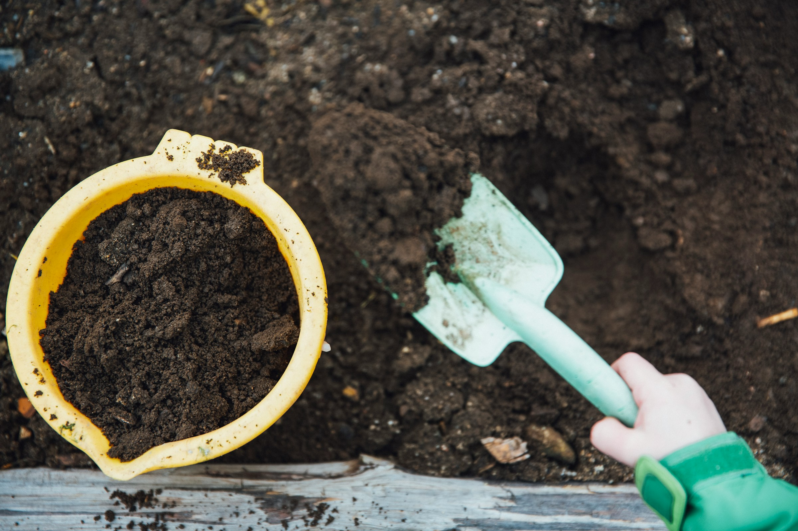

El humus de lombriz es uno de los mejores usos finales de una vermicompostera doméstica. Mejora la estructura del sustrato, aporta nutrientes en forma gradual y aumenta la actividad biológica alrededor de las raíces.

Pero no debe usarse como si fuera tierra universal ni como fertilizante concentrado. En maceteros, lo más seguro es incorporarlo como una fracción de la mezcla o aplicarlo en pequeñas cantidades sobre la superficie.

La regla práctica es simple: usa humus de lombriz como mejorador de sustrato, no como único medio de cultivo.

## 1. Qué aporta el humus de lombriz

El humus de lombriz es el material estabilizado que queda después de que lombrices y microorganismos transforman residuos orgánicos.

En maceteros puede aportar:

- Materia orgánica estable
- Nutrientes disponibles de liberación gradual
- Mejor retención de humedad
- Mayor actividad microbiana
- Mejor estructura del sustrato
- Compuestos húmicos beneficiosos para el suelo

Su efecto suele ser más equilibrado que el de muchos fertilizantes solubles, porque no entrega una descarga brusca de nutrientes.

Aun así, no reemplaza todos los componentes de una buena mezcla para maceteros. Las raíces también necesitan aireación, drenaje y soporte físico.

## 2. Cuánto humus usar en una macetero

Para la mayoría de las plantas en macetero, una proporción segura es usar entre 10% y 20% de humus de lombriz dentro de la mezcla total.

| Uso                          | Proporción recomendada  |
| ---------------------------- | ----------------------- |
| Plantas de interior          | 10% a 15%               |
| Hortalizas en macetero       | 15% a 20%               |
| Hierbas aromáticas           | 10% a 20%               |
| Suculentas y cactus          | 5% a 10%                |
| Almácigos                    | 5% a 10%, bien harneado |
| Árboles frutales en macetero | 10% a 20%               |

Más no siempre es mejor.

Un exceso de humus puede retener demasiada humedad, compactar la mezcla y reducir la aireación. Esto es especialmente importante en plantas sensibles al exceso de agua, como cactus, suculentas, sansevierias y muchas plantas de interior.

## 3. Cómo mezclar humus con sustrato

La forma más estable de usar humus es mezclarlo con otros materiales.

Una mezcla básica para plantas de interior puede ser:

- 3 Partes de sustrato para maceteros
- 1 Parte de humus de lombriz
- 1 Parte de material aireante, como perlita, pomita, corteza fina o fibra vegetal gruesa.

Para hortalizas en macetero, puedes usar una mezcla un poco más rica:

- 3 Partes de sustrato
- 1 Parte de humus
- 1 Parte de compost maduro o fibra vegetal.
- Material aireante si el sustrato es pesado

El objetivo es que la mezcla quede fértil, pero también suelta.

Una macetero saludable no depende solo de nutrientes. Depende de un equilibrio entre agua, aire y materia orgánica.

## 4. Aplicación superficial

También puedes aplicar humus sobre una macetero ya plantada.

Este método sirve para mantener o recuperar plantas sin trasplantarlas.

Pasos:

1. Retira hojas secas o restos superficiales
2. Afloja suavemente el primer centímetro de sustrato sin dañar raíces.
3. Agrega una capa delgada de humus
4. Distribuye de forma pareja
5. Riega suavemente

Como referencia:

| Tamaño de macetero | Cantidad orientativa    |
| ------------------ | ----------------------- |
| macetero pequeña   | 1 a 2 cucharadas        |
| macetero mediana   | 1 puñado pequeño        |
| macetero grande    | 2 a 4 puñados           |
| Jardinera          | Capa fina de 0,5 a 1 cm |

No entierres grandes cantidades junto al cuello de la planta. Mantén una pequeña distancia del tallo para evitar exceso de humedad en esa zona.

## 5. Uso en plantas de interior

En plantas de interior, el principal riesgo no suele ser falta de nutrientes. Suele ser exceso de agua, mal drenaje o poca luz.

Por eso, usa humus con moderación.

Funciona bien en:

- Monstera
- Philodendron
- Pothos
- Ficus
- Calatheas
- Helechos
- Cintas
- Peperomias
- Plantas de follaje en general

Usa dosis bajas y observa la respuesta.

Si una planta está en un lugar con poca luz, no aumentes mucho la fertilidad del sustrato. Con baja luz, la planta consume menos agua y nutrientes. Un sustrato demasiado rico y húmedo puede favorecer problemas de raíz.

## 6. Uso en hortalizas y hierbas aromáticas

Las hortalizas en macetero suelen aprovechar bien el humus porque tienen crecimiento rápido y alta demanda de nutrientes.

Puede usarse en:

- Tomates
- Ajíes
- Lechugas
- Acelgas
- Rúcula
- Frutillas
- Orégano
- Menta
- Albahaca
- Perejil
- Cilantro

Para hortalizas de fruto, como tomates o ajíes, el humus ayuda como base orgánica, pero puede no ser suficiente durante toda la temporada. En maceteros pequeñas, los nutrientes se agotan más rápido que en suelo abierto.

En hierbas mediterráneas como romero, lavanda, tomillo y orégano, usa menos humus y prioriza drenaje. No todas las aromáticas quieren un sustrato muy húmedo o muy rico.

## 7. Uso en cactus y suculentas

Cactus y suculentas necesitan especial cuidado.

No conviene usar mucho humus porque retiene humedad y puede volver el sustrato demasiado orgánico.

Para estas plantas, usa una dosis baja:

- 5% A 10% de humus como máximo
- Mezcla siempre con material mineral
- Prioriza drenaje y aireación
- Evita aplicaciones superficiales gruesas

Una mezcla más segura para suculentas puede incluir:

- Sustrato mineral o arenoso
- Pomita, perlita o gravilla fina
- Una pequeña fracción de humus bien maduro y harneado.

Si la planta vive en interior con poca luz, usa todavía menos.

## 8. Cómo saber si el humus está listo para usar

No todo material que sale de la vermicompostera está listo para una macetero.

Usa humus solo cuando tenga:

- Color oscuro
- Olor a tierra húmeda
- Textura suelta
- Pocos restos reconocibles
- Ausencia de olor agrio o podrido
- Baja presencia de residuos frescos

Si el material todavía contiene restos de comida, exceso de humedad o mal olor, no lo uses directamente en maceteros.

Devuélvelo a la vermicompostera o déjalo madurar un tiempo más.

El humus inmaduro puede competir por oxígeno, atraer mosquitas o afectar raíces sensibles.

## 9. Frecuencia de aplicación

No necesitas aplicar humus todas las semanas.

Para la mayoría de las maceteros, basta con renovar una pequeña cantidad cada cierto tiempo.

Como referencia:

| Tipo de planta               | Frecuencia orientativa               |
| ---------------------------- | ------------------------------------ |
| Plantas de interior          | Cada 2 a 4 meses                     |
| Hortalizas en crecimiento    | Cada 4 a 6 semanas                   |
| Aromáticas                   | Cada 2 a 3 meses                     |
| Cactus y suculentas          | 1 a 2 veces al año, en dosis baja    |
| Árboles frutales en macetero | Cada 2 a 3 meses en temporada activa |

Ajusta según crecimiento, estación y estado de la planta.

En invierno muchas plantas reducen su actividad. En ese período conviene aplicar menos o esperar hasta primavera.

## 10. Recomendación rápida

Para maceteros, usa humus de lombriz en dosis moderadas.

Mezcla entre 10% y 20% en el sustrato para la mayoría de las plantas. Usa menos en cactus, suculentas y especies sensibles al exceso de humedad.

Si la planta ya está establecida, aplica una capa fina en la superficie y riega suavemente.

El humus funciona mejor cuando complementa una buena mezcla de sustrato. No corrige por sí solo una macetero sin drenaje, con poca luz o con riego excesivo.

## Errores comunes

| Error                           | Consecuencia                       |
| ------------------------------- | ---------------------------------- |
| Usar humus puro como sustrato   | Exceso de humedad y baja aireación |
| Aplicar demasiado en suculentas | Riesgo de pudrición                |
| Usar humus inmaduro             | Mosquitas, olor y estrés radicular |
| Compactar la superficie         | Menor intercambio de aire          |
| Aplicar mucho en invierno       | Nutrientes poco aprovechados       |
| Creer que reemplaza el drenaje  | Problemas de raíz                  |

## Preguntas frecuentes

### ¿Puedo plantar directamente en humus de lombriz?

No es recomendable. El humus debe mezclarse con otros materiales para asegurar aireación, drenaje y estructura.

### ¿Cuánto humus pongo en una macetero?

Para la mayoría de las plantas, entre 10% y 20% de la mezcla total. En cactus y suculentas, menos.

### ¿El humus puede quemar las plantas?

El humus maduro es suave comparado con fertilizantes concentrados, pero un exceso puede afectar la estructura del sustrato y retener demasiada humedad.

### ¿Sirve para plantas de interior?

Sí, en dosis moderadas. Es especialmente útil en plantas de follaje, siempre que la macetero tenga buen drenaje y suficiente luz.

### ¿Puedo usar humus recién cosechado?

Solo si está maduro. Debe oler a tierra húmeda y no contener restos frescos de comida.

### ¿Cada cuánto debo aplicar humus?

Depende de la planta. En interior puede bastar cada 2 a 4 meses. En hortalizas activas, cada 4 a 6 semanas en dosis moderadas.
