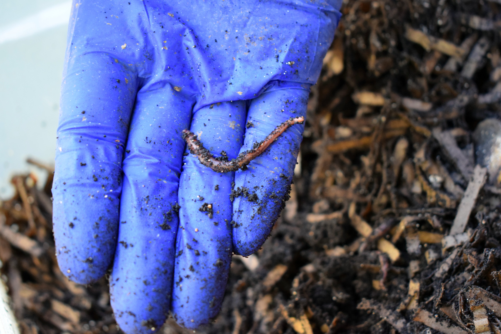

El vermicompostaje no se detiene automáticamente en invierno. Las lombrices rojas californianas (_Eisenia fetida_) pueden seguir viviendo y procesando residuos durante los meses fríos, pero lo hacen más lento.

El cambio principal es el ritmo. Cuando baja la temperatura, disminuye la actividad de las lombrices y de los microorganismos que descomponen la materia orgánica. Si sigues alimentando igual que en verano, los residuos pueden acumularse, aumentar la humedad y generar malos olores.

La clave del invierno es ajustar el manejo: menos comida, más control de humedad y mejor protección contra lluvia, frío y cambios bruscos de temperatura.

## 1. Qué cambia en una vermicompostera durante el invierno

Durante el invierno, la vermicompostera suele trabajar más lento.

Puedes notar que:

- Los residuos tardan más en desaparecer
- Las lombrices se mueven menos
- Hay menor reproducción
- El sustrato permanece húmedo por más tiempo
- Aparece más condensación
- La primera cosecha puede demorarse más

Esto es normal.

No significa que la vermicompostera esté fallando. Significa que el ecosistema está respondiendo a una menor temperatura ambiental.

El error común es intentar forzar el proceso agregando más comida. Eso casi siempre empeora el problema.

## 2. Temperatura y actividad de las lombrices

Las lombrices trabajan mejor con temperaturas moderadas. En invierno pueden seguir activas, pero reducen su metabolismo cuando el ambiente se enfría.

En términos prácticos:

| Condición          | Qué ocurre                                              |
| ------------------ | ------------------------------------------------------- |
| Frío moderado      | El proceso continúa, pero más lento                     |
| Frío prolongado    | Disminuye la alimentación y reproducción                |
| Heladas            | Riesgo para lombrices expuestas o contenedores pequeños |
| Sustrato protegido | Mayor estabilidad y menor estrés                        |

La temperatura importante no es solo la del aire. Es la temperatura interna del sustrato.

Una vermicompostera con buen volumen de sustrato, suficiente material seco y ubicación protegida mantiene mejor la temperatura que una caja pequeña y expuesta.

## 3. Cómo ajustar la alimentación

En invierno, alimenta menos.

No uses el mismo ritmo que en primavera o verano.

Antes de agregar más residuos, revisa si la comida anterior ya fue procesada. Si todavía reconoces trozos frescos, espera algunos días más.

Buenas prácticas:

- Agrega porciones pequeñas
- Pica los residuos en trozos más chicos
- Entierra la comida bajo la superficie
- Cubre siempre con material seco
- Evita grandes cantidades de fruta muy acuosa
- Congela y descongela residuos si quieres facilitar su descomposición.

En invierno no conviene acumular alimento fresco dentro del sistema. La comida que las lombrices no alcanzan a procesar puede fermentar, compactarse y consumir oxígeno.

## 4. Control de humedad

En invierno, la humedad suele ser más difícil de manejar que el frío.

Hay menos evaporación, las lombrices comen más lento y la lluvia puede entrar si la vermicompostera está mal protegida.

Señales de exceso de humedad:

- Olor agrio
- Material pastoso
- Aparición de lixiviado
- Mosquitas
- Lombrices en paredes o tapa
- Residuos blandos acumulados

Para corregirlo:

- Suspende la alimentación por algunos días
- Agrega cartón corrugado picado
- Incorpora cajas de huevo trituradas
- Suma hojas secas
- Mejora la ventilación
- Protege de la lluvia directa

La prueba del puño sigue siendo la mejor herramienta. El sustrato debe sentirse como una esponja estrujada: húmedo, pero sin escurrir agua.

## 5. Protección contra la lluvia

Una vermicompostera no debería recibir lluvia directa.

La lluvia excesiva puede saturar el sustrato, desplazar el oxígeno y generar lixiviado. Esto es especialmente relevante en el sur de Chile, pero también puede ocurrir en patios y balcones de la zona central durante temporales.

Para protegerla:

- Ubícala bajo techo
- Usa una tapa ventilada
- Evita que el agua escurra desde canaletas o muros.
- Elévala del suelo si hay riesgo de acumulación de agua.
- Revisa la bandeja inferior después de lluvias intensas.

La tapa debe proteger, pero no sellar por completo. Un sistema hermético retiene humedad y reduce el intercambio de aire.

## 6. Dónde ubicarla en invierno

La mejor ubicación depende del tipo de vivienda.

### En departamento

Suelen funcionar bien:

- Logias
- Balcones techados
- Lavaderos ventilados
- Cocinas frescas y bien ventiladas
- Bodegas interiores sin calefacción directa

Evita poner la vermicompostera junto a estufas o calefactores. El calor directo puede secar la superficie y generar cambios bruscos.

### En casa con patio

Conviene ubicarla:

- Bajo techo
- En sombra luminosa
- Protegida de lluvia y heladas
- Sobre una base elevada
- Lejos de zonas que se inunden

En invierno, una ubicación demasiado expuesta puede enfriar y saturar el sistema.

## 7. Cuidados según zona de Chile

### Zona norte

El invierno suele ser más suave, pero puede haber noches frías y ambientes secos.

Conviene revisar humedad y evitar que el sistema se seque por viento o baja humedad ambiental.

### Zona central

El principal riesgo es la combinación de frío moderado, lluvia ocasional y menor evaporación.

Conviene reducir alimentación y mantener la vermicompostera bajo techo.

### Zona sur

El exceso de lluvia es el punto crítico.

Conviene priorizar protección contra agua directa, buena ventilación y abundante material seco.

### Zonas cordilleranas y australes

El frío puede volver el proceso muy lento.

Conviene ubicar la vermicompostera en un espacio más protegido, usar mayor volumen de sustrato y alimentar muy poco durante los períodos más fríos.

## 8. Qué no hacer en invierno

No intentes acelerar el proceso con intervenciones agresivas.

Evita:

- Poner la vermicompostera al sol directo fuerte sin control.
- Agregar mucha comida para "reactivarla"
- Cerrar completamente la ventilación
- Regar por rutina
- Usar cal, ceniza o fertilizantes para corregir sin diagnóstico.
- Revolver todo el sustrato con frecuencia
- Cosechar material claramente inmaduro

El invierno exige paciencia.

Una vermicompostera lenta pero estable es preferible a una vermicompostera sobrealimentada y húmeda.

## 9. Señales de que todo va bien

Aunque el proceso sea más lento, el sistema puede estar saludable.

Buenas señales:

- Olor a tierra húmeda
- Lombrices dentro del sustrato
- Ausencia de olor a podrido
- Humedad estable
- Residuos que disminuyen con el tiempo
- Presencia de humus oscuro en zonas antiguas
- Poca o nula producción de lixiviado

Si la vermicompostera huele bien y las lombrices permanecen en el sustrato, probablemente no necesitas hacer grandes cambios.

## 10. Recomendación rápida

En invierno, reduce la alimentación y controla mejor la humedad.

Protege la vermicompostera de la lluvia directa, evita cambios bruscos de temperatura y agrega material seco cada vez que alimentes.

Si el proceso se vuelve lento, no lo fuerces. Alimenta menos, espera más y mantén el sistema aireado.

Las lombrices pueden seguir trabajando durante el invierno, pero necesitan estabilidad.

## Errores comunes

| Error                                | Consecuencia                     |
| ------------------------------------ | -------------------------------- |
| Alimentar igual que en verano        | Acumulación de residuos          |
| Dejar la vermicompostera bajo lluvia | Exceso de humedad                |
| Cerrar completamente la tapa         | Falta de oxígeno                 |
| Regar por rutina                     | Sustrato saturado                |
| Cosechar demasiado temprano          | Humus inmaduro                   |
| Revolver todo el sistema             | Estrés para la colonia           |
| Ignorar el lixiviado frecuente       | Problema de humedad no corregido |

## Preguntas frecuentes

### ¿Las lombrices mueren en invierno?

No necesariamente. En muchas zonas de Chile sobreviven bien si la vermicompostera está protegida. Lo normal es que trabajen más lento.

### ¿Debo alimentar menos en invierno?

Sí. Si los residuos tardan más en desaparecer, reduce la cantidad y espera más entre alimentaciones.

### ¿Puedo dejar la vermicompostera afuera?

Sí, siempre que esté protegida de lluvia directa, heladas intensas y acumulación de agua.

### ¿Qué hago si hay mucho lixiviado?

Suspende la alimentación, agrega cartón u hojas secas y mejora la ventilación. El lixiviado frecuente indica exceso de humedad.

### ¿Puedo cosechar humus en invierno?

Sí, si el material está maduro. Pero el proceso puede tardar más, así que no coseches solo por fecha.

### ¿Conviene mover la vermicompostera al interior?

Puede ser útil en zonas muy frías o lluviosas. El lugar debe ser fresco, ventilado y sin calefacción directa.
